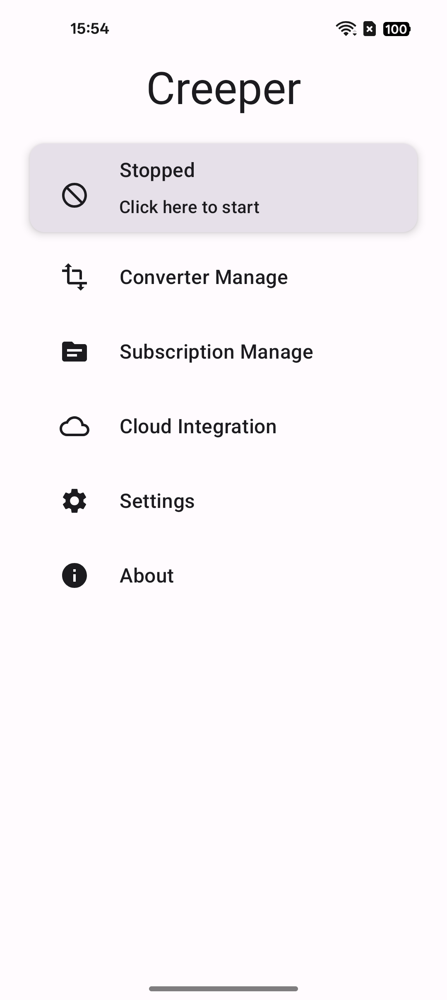
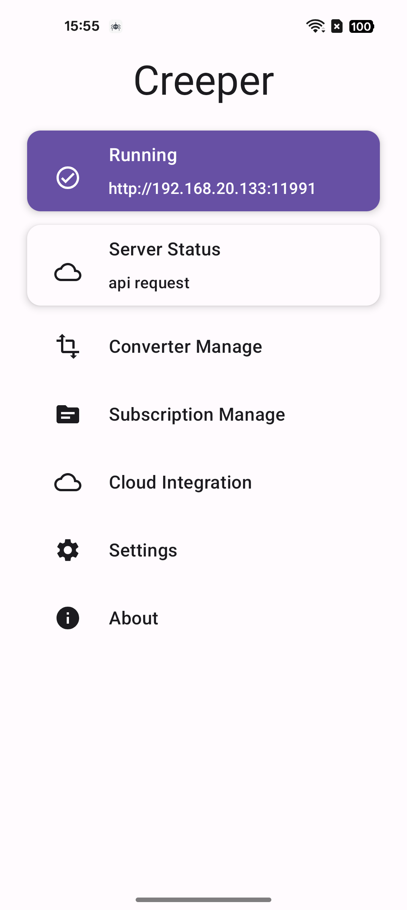
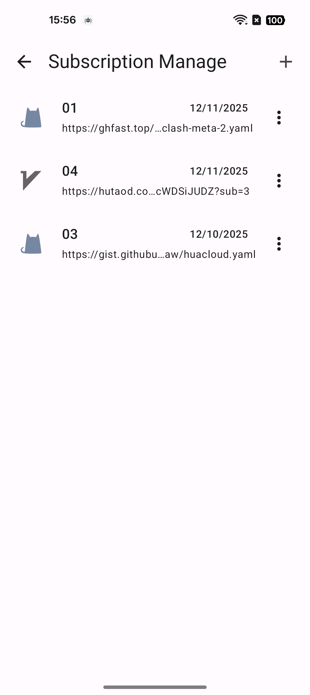

# Creeper

**Creeper** 是一款专为代理订阅管理与转换设计的 Android 应用程序。它内置了 Web 服务器，支持直接从 Android 设备进行灵活的订阅管理和分发。

### 📸 界面截图

  
  
  
  

### 🚀 功能特性

- **订阅管理**: 轻松添加、编辑、删除和查看代理订阅源。
- **内置 Web 服务器**: 基于 AndServer 构建的内置 HTTP 服务器，提供 RESTful API 并分发转换后的订阅文件。
- **协议支持**: 支持多种代理协议，包括 Clash 和 V2Ray。
- **现代技术栈**:
    - **UI**: 采用 Jetpack Compose 构建现代化响应式界面。
    - **依赖注入**: 使用 Hilt (Dagger) 构建稳健的架构。
    - **数据库**: 使用 Room 进行本地数据持久化。
    - **网络请求**: 使用 Retrofit 和 OkHttp 进行可靠的数据抓取。
    - **服务器**: 集成 AndServer 在 Android 应用内运行 Web 服务。
- **前台服务**: 确保本地服务器在后台持续稳定运行。

### 🛠️ 项目架构

项目遵循现代 Android 开发最佳实践：
- 使用 Jetpack Compose 的 **MVVM / MVI** 模式。
- **仓库模式 (Repository Pattern)**：抽象数据库、文件和网络数据访问。
- **Hilt**：在 Activity、Service 和 Controller 中实现全域依赖注入。

### 📦 快速上手

1.  **编译**: 使用 Android Studio (建议 Ladybug 或更新版本) 打开项目。
2.  **运行**: 部署到 Android 设备 (支持 API 24+)。
3.  **使用**: 打开应用即可管理订阅。本地服务器将以后台前台服务形式启动，并根据配置的端口提供 API 访问。
